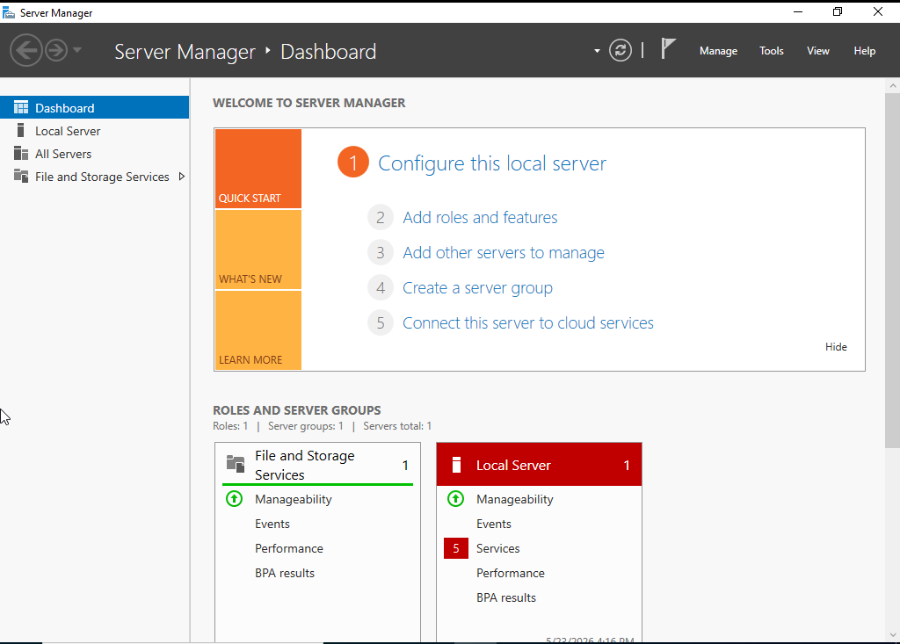
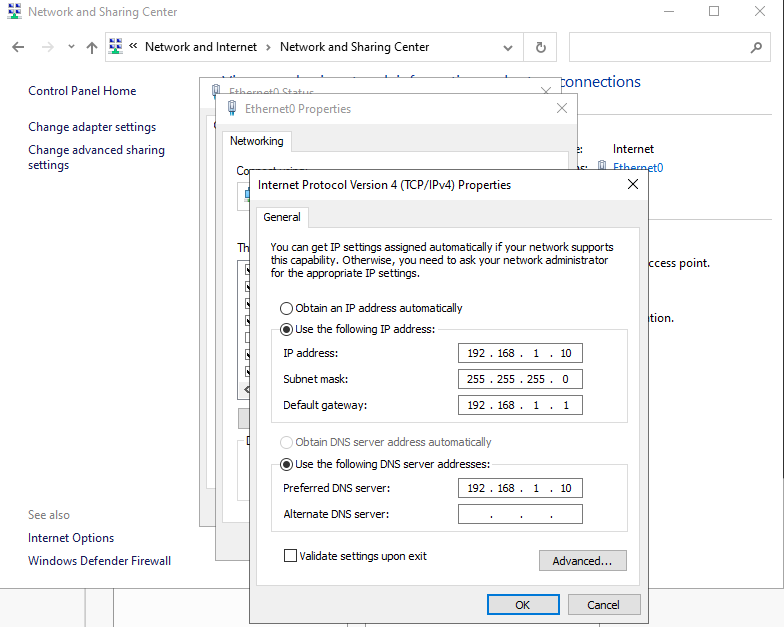
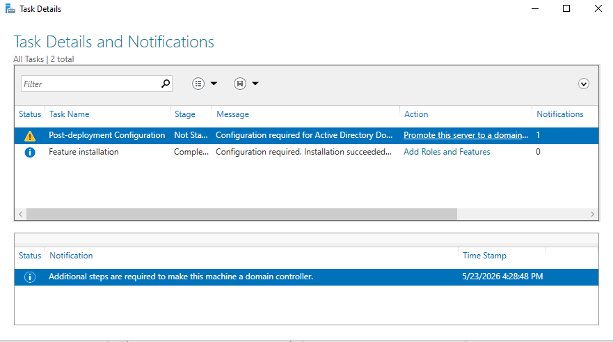
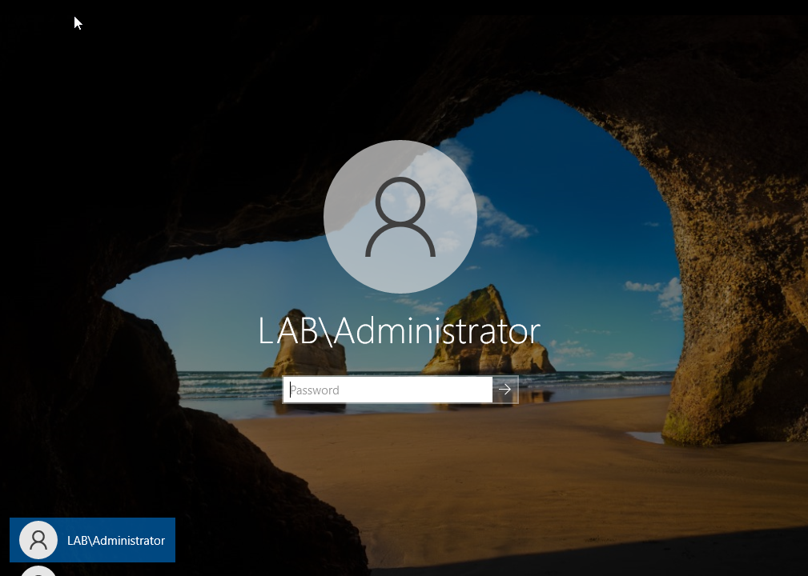
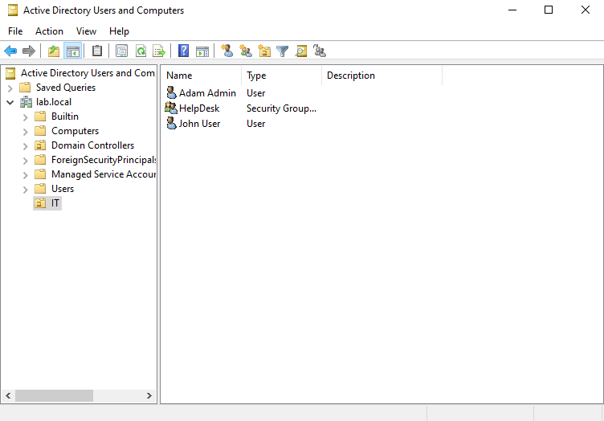
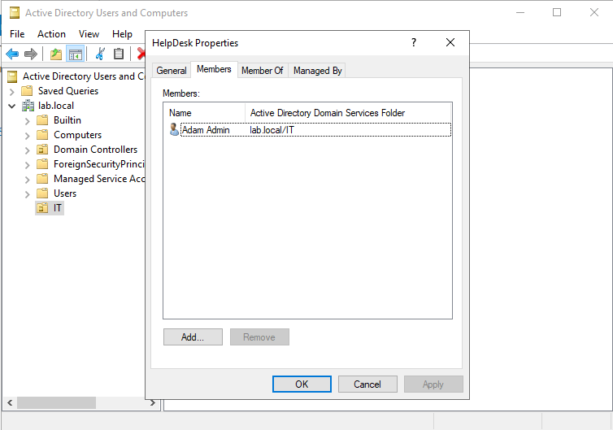
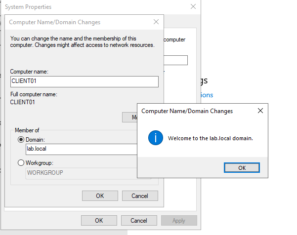
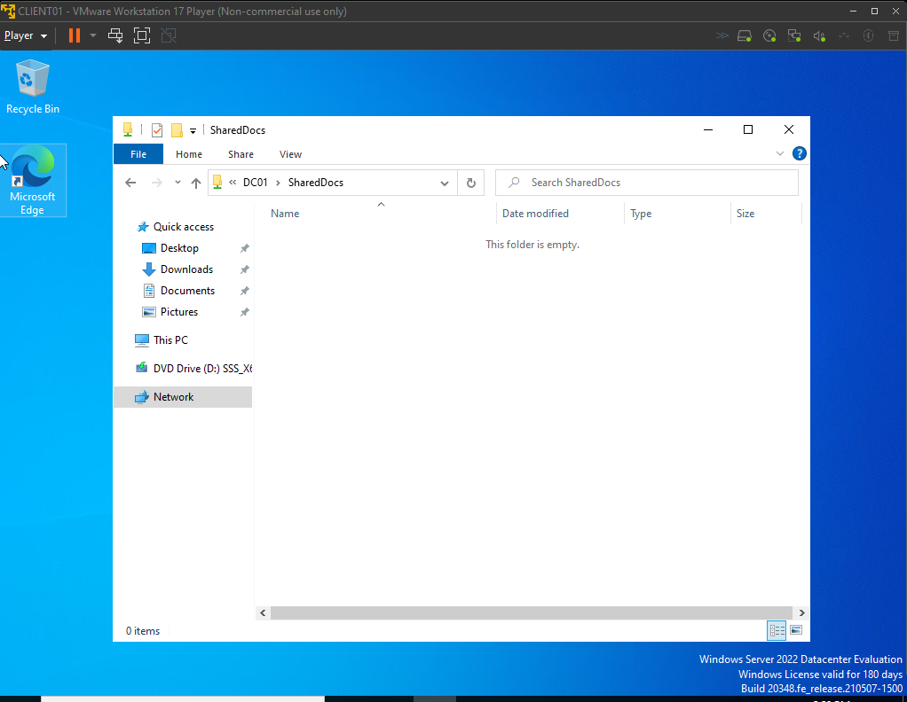
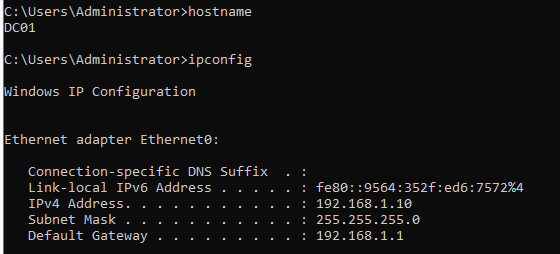

# Active Directory Home Lab

## Overview
This project demonstrates the creation of a Windows Active Directory home lab environment using VMware Workstation. The lab simulates a basic enterprise network with a Domain Controller, domain users/groups, a Windows client machine, and shared network resources.

---

## Environment

### Virtualization Platform
- VMware Workstation 17 Player

### Operating Systems
- Windows Server 2022
- Windows 10 Client

---

## Lab Objectives

- Install and configure Windows Server 2022
- Configure a static IP address
- Install Active Directory Domain Services (AD DS)
- Promote the server to a Domain Controller
- Create Organizational Units (OUs)
- Create domain users and security groups
- Configure shared folder permissions
- Create a Windows client VM
- Join the client machine to the domain
- Verify domain authentication and network share access

---

## Network Configuration

<table>
<tr>
<td valign="top">

### Domain Controller (DC01)

| Setting | Value |
|---|---|
| Hostname | DC01 |
| IP Address | 192.168.1.10 |
| Subnet Mask | 255.255.255.0 |
| Default Gateway | 192.168.1.1 |
| DNS Server | 192.168.1.10 |

</td>

<td valign="top">

### Client Machine (CLIENT01)

| Setting | Value |
|---|---|
| Hostname | CLIENT01 |
| DNS Server | 192.168.1.10 |

</td>
</tr>
</table>

---

## Active Directory Configuration

### Organizational Unit
- IT

### Users Created
- Adam Admin
- John User

### Security Group
- HelpDesk

### Shared Folder

```text
\\DC01\SharedDocs
```

Permissions were assigned to the HelpDesk security group to simulate enterprise file sharing and access control.

---
## Department-Based Access Control

This lab was expanded to simulate a small business environment using department-based Organizational Units, security groups, and shared folders.

### Departments Created
- HR
- Finance
- Sales

### Security Groups
- HRTeam
- FinanceTeam
- SalesTeam

### Shared Resources
- \\DC01\HRDocs
- \\DC01\FinanceDocs
- \\DC01\SalesDocs

Access permissions were configured using both:
- Share permissions
- NTFS(Security) permissions

Validation testing was performed from CLIENT01 to verify:
- authorized access succeeded
- unauthorized access was denied

## Skills Demonstrated

- Windows Server Administration
- Active Directory Administration
- DNS Configuration
- User and Group Management
- File Share Permissions
- Domain Joining
- Network Troubleshooting
- VMware Virtualization
- Infrastructure Documentation

---

## Screenshots

### Server Manager


### Static IP Configuration


### AD DS Installation


### Domain Controller Login


### Active Directory Users and Groups


### Group Membership


### Domain Join Success


### Shared Folder Access


### IP Configuration Verification


---

## Key Takeaways

This lab provided hands-on experience with:
- Deploying a Windows domain environment
- Managing Active Directory objects
- Configuring DNS for domain communication
- Troubleshooting authentication and networking issues
- Configuring shared network resources and permissions

This project helped strengthen practical system administration and troubleshooting skills commonly used in enterprise IT environments.
