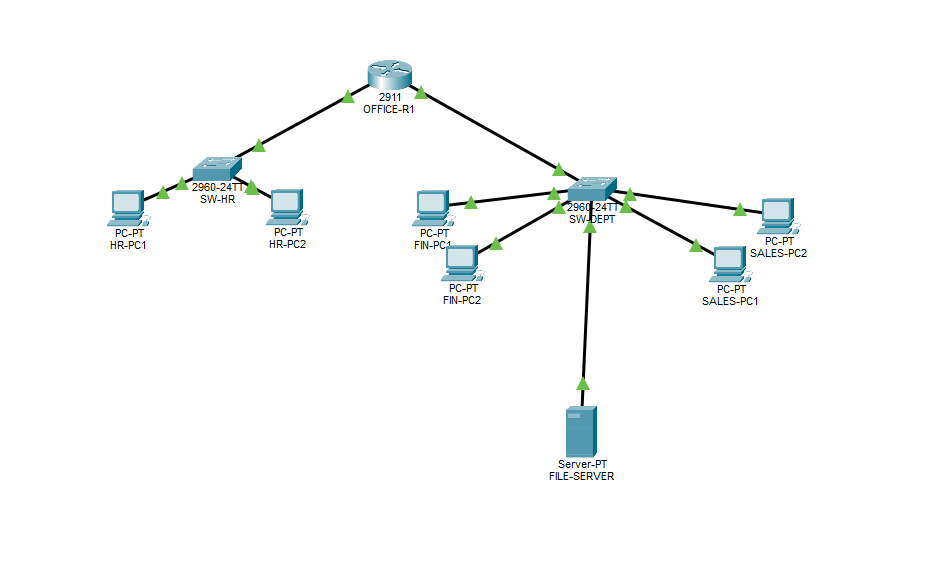
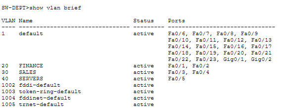
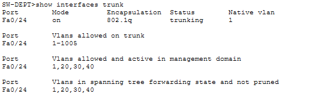
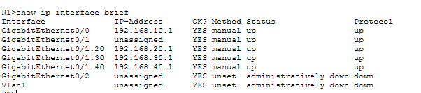
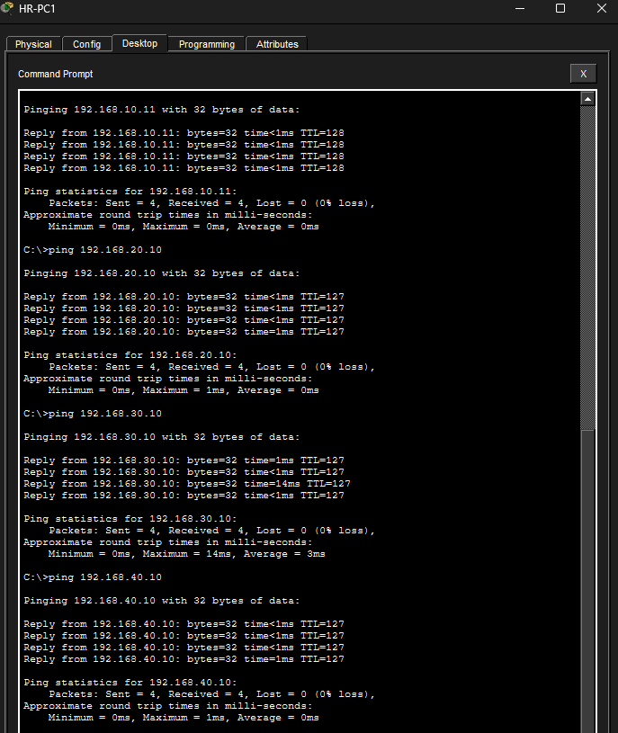

# Small Office Network Lab

## Overview

This lab simulates a small business network environment using Cisco Packet Tracer. The objective was to design and configure a segmented office network using VLANs, trunking, and inter-VLAN routing.

The network was divided into separate departments:
- HR
- Finance
- Sales
- Server Network

Devices were configured to communicate across VLANs using Router-on-a-Stick routing.

---

## Lab Objectives

- Design a small office network topology
- Configure VLANs for department segmentation
- Configure trunk ports between switch and router
- Implement Router-on-a-Stick inter-VLAN routing
- Assign static IP addressing
- Validate connectivity between all networks

---

## Network Topology

### Devices Used

- 1x Cisco 2911 Router
- 2x Cisco 2960 Switches
- 6x PCs
- 1x Server

---

## VLAN Configuration

| VLAN ID | Department | Network |
|---|---|---|
| 10 | HR | 192.168.10.0/24 |
| 20 | Finance | 192.168.20.0/24 |
| 30 | Sales | 192.168.30.0/24 |
| 40 | Servers | 192.168.40.0/24 |

---

## Router Subinterfaces

| Interface | IP Address |
|---|---|
| G0/0 | 192.168.10.1 |
| G0/1.20 | 192.168.20.1 |
| G0/1.30 | 192.168.30.1 |
| G0/1.40 | 192.168.40.1 |

---

## Skills Demonstrated

- VLAN creation and management
- Switch port assignment
- 802.1Q trunking
- Router-on-a-Stick configuration
- Static IP addressing
- Inter-VLAN routing
- Network troubleshooting and connectivity testing

---

## Screenshots

### Full Network Topology

### VLAN Configuration

### Trunk Configuration

### Router Subinterface Configuration

### Inter-VLAN Connectivity Testing

---

## Key Takeaways

This lab provided hands-on experience with:
- VLAN segmentation
- Layer 2 switching
- Layer 3 routing
- Trunking
- Router-on-a-Stick deployment
- Inter-VLAN communication

The completed topology successfully allowed communication between multiple departmental networks while maintaining logical network separation.
